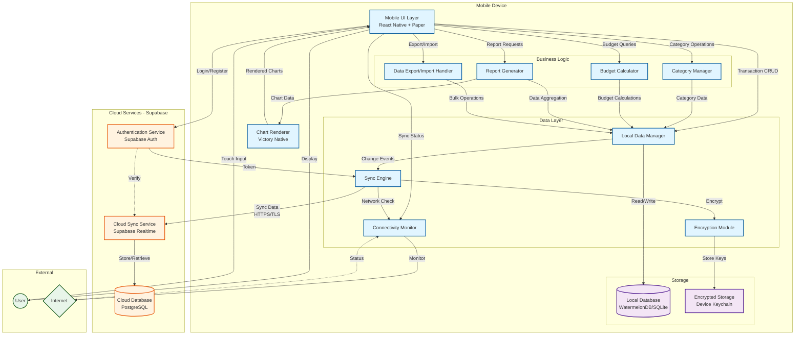

# System Architecture Diagram

## Component Interaction Flow

### Transaction Creation (Offline)
1. User enters transaction in Mobile UI
2. UI validates input and sends to Local Data Manager
3. Local Data Manager writes to Local Database (encrypted)
4. Local Data Manager notifies Sync Engine of change
5. Connectivity Monitor checks network status
6. If offline: change queued for later sync
7. If online: Sync Engine encrypts and sends to Cloud Sync Service
8. Cloud Sync Service stores in Cloud Database

### Budget Check
1. User views budget status in Mobile UI
2. UI requests data from Budget Calculator
3. Budget Calculator queries Local Data Manager
4. Local Data Manager retrieves transactions and budgets from Local Database
5. Budget Calculator computes spending vs limits
6. Results displayed in UI with visual indicators

### Report Generation
1. User selects report period in Mobile UI
2. UI requests report from Report Generator
3. Report Generator queries Local Data Manager for transaction data
4. Local Data Manager retrieves filtered data from Local Database
5. Report Generator aggregates and calculates totals
6. Report Generator sends chart data to Chart Renderer
7. Chart Renderer creates visualizations
8. UI displays report with charts

### Sync Process (Background)
1. Connectivity Monitor detects internet connection
2. Connectivity Monitor notifies Sync Engine
3. Sync Engine retrieves pending changes from Local Database
4. Encryption Module encrypts data payload
5. Sync Engine sends encrypted data to Cloud Sync Service via HTTPS
6. Cloud Sync Service authenticates request with Authentication Service
7. Cloud Sync Service writes data to Cloud Database
8. Cloud Sync Service returns success confirmation
9. Sync Engine marks changes as synced in Local Database
10. UI displays "synced" status to user

### Data Recovery (New Device)
1. User installs app on new device
2. User logs in via Authentication Service
3. Sync Engine requests user's data from Cloud Sync Service
4. Cloud Sync Service retrieves data from Cloud Database
5. Sync Engine decrypts and writes to Local Database
6. User's complete transaction history restored